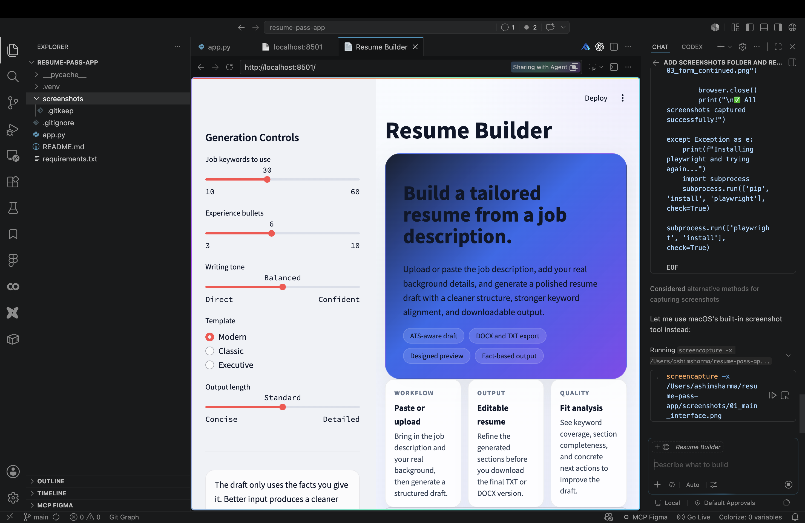
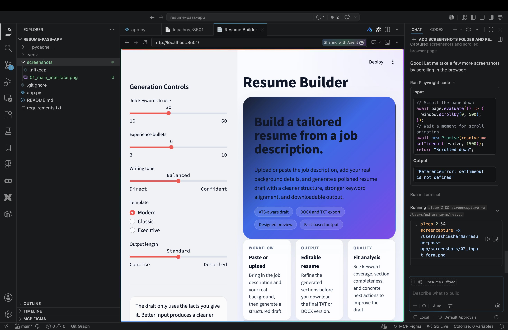

# Resume Builder App 📄

A Streamlit-powered application that takes a job description and your base profile/resume, then generates a tailored resume draft optimized for the specific position.

## 🎯 Features

- **Tailored Resume Generation** - Generates a customized resume based on job description analysis
- **Keyword Extraction** - Automatically extracts relevant keywords from job postings
- **Smart Sections** - Summary, skills, experience, projects, and education sections
- **Multiple Export Formats** - Download as DOCX or TXT
- **File Upload Support** - Optional PDF, DOCX, and TXT upload for source material
- **Fit Assessment** - Quality analysis showing keyword alignment with job requirements
- **Text Paste Option** - Paste content directly if file parsing is unavailable

## � Screenshots

### Main Interface

*The main interface showing generation controls and hero section*

### Input Form

*Job description and base profile input areas*

### Form Fields

*Additional form fields for user information, skills, and education*

## �📋 Requirements

- Python 3.8 or higher
- pip (Python package manager)

## 🚀 Installation & Setup

### macOS / Linux

```bash
# Clone the repository
git clone https://github.com/ashim1600/Resume-pass-app.git
cd Resume-pass-app

# Create a virtual environment
python3 -m venv .venv

# Activate the virtual environment
source .venv/bin/activate

# Install dependencies
pip install -r requirements.txt
```

### Windows

```bash
# Clone the repository
git clone https://github.com/ashim1600/Resume-pass-app.git
cd Resume-pass-app

# Create a virtual environment
python -m venv .venv

# Activate the virtual environment
.venv\Scripts\activate

# Install dependencies
pip install -r requirements.txt
```

## ▶️ Running the App

```bash
# Make sure your virtual environment is activated
source .venv/bin/activate  # macOS/Linux
# or
.venv\Scripts\activate  # Windows

# Start the Streamlit server
streamlit run app.py
```

The app will be available at:
- **Local URL**: `http://localhost:8501`
- **Network URL**: `http://<your-machine-ip>:8501`

## 📦 Dependencies

The project uses the following packages (see `requirements.txt`):

- **streamlit** (>=1.36) - Web app framework
- **pypdf** (>=4.2.0) - PDF reading and parsing
- **python-docx** (>=1.1.2) - DOCX file creation and manipulation

## 💡 How to Use

1. **Input Job Description**
   - Upload a job posting (TXT, DOCX, PDF) or paste the job description directly

2. **Provide Your Information**
   - Enter your background details in the form fields (summary, skills, experience, projects, education)
   - Or upload your existing resume/profile files

3. **Generate Resume**
   - Click the generate button to create a tailored resume
   - The app analyzes keywords from the job description and incorporates them naturally

4. **Download**
   - Export your tailored resume as DOCX or TXT format
   - Use immediately in applications

## ⚠️ Important Notes

- **You provide the facts** - The app generates the structure and organization, but you must provide your own accurate background information
- **Text paste alternative** - If file parsing fails, you can always paste text directly into the app
- **Optional file support** - PDF and DOCX extraction depends on the optional packages in `requirements.txt`
- **No experience fabrication** - The app will not invent or hallucinate work experience

## 🛠️ Troubleshooting

**Streamlit not found?**
```bash
source .venv/bin/activate
pip install -r requirements.txt
```

**Port 8501 already in use?**
```bash
streamlit run app.py --server.port 8502
```

**File upload not working?**
Make sure you have the optional dependencies:
```bash
pip install pypdf python-docx
```

## 📝 File Structure

```
resume-pass-app/
├── app.py                 # Main Streamlit application
├── requirements.txt       # Python dependencies
├── .gitignore            # Git ignore rules
├── README.md             # This file
└── screenshots/          # Screenshots and examples
```

## 📄 License

This project is open source and available on [GitHub](https://github.com/ashim1600/Resume-pass-app).

## 🤝 Contributing

Feel free to fork this repository, make improvements, and submit pull requests!

## 📧 Support

For issues, questions, or suggestions, please open an issue on the [GitHub repository](https://github.com/ashim1600/Resume-pass-app/issues).
